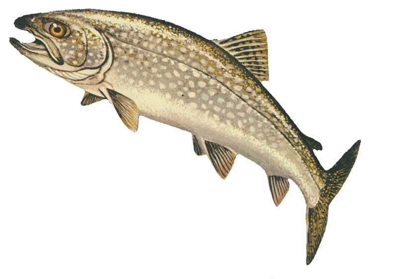

<div align="center">
<h1>

<br>
Trout
</h1>
</div>

<p align="center">
<em>Type-Level Routing for PureScript</em>
</p>

<hr>

_Trout_ is a Servant-style routing type API. By using *routing types* you get
static guarantees about having handled all cases. You also get a lot of stuff
for free, such as type-safe parameters for handlers, and automatically
generated type-safe URIs to endpoints.

The primary use of Trout right now is for [Hyper](https://hyper.wickstrom.tech)
and the
[purescript-hypertrout](https://owickstrom.github.io/purescript-hypertrout/)
server package. There is, however, nothing Hyper-specific about this package.

## Usage

```bash
bower install --save purescript-trout
```

_This package should get its own proper documentation soon. In the meantime,
see [purescript-hypertrout](https://owickstrom.github.io/purescript-hypertrout/)._

## API Documentation

This library's API documentation is published [on Pursuit](https://pursuit.purescript.org/packages/purescript-trout).

## Changelog

* 0.10.0
  - Routes are now named. The following routes are written in the old format,
    compatible with 0.9.x:

    ```purescript
    type TestSite =
           Resource (Get (HTML :<|> JSON) Home)
      :<|> "users" :/ Resource (Get (HTML :<|> JSON) Home)
    ```

    When ported to 0.10.0, they become named:

    ```purescript
    type TestSite =
           "home"  := Resource (Get (HTML :<|> JSON) Home)
      :<|> "users" := "users" :/ Resource (Get (HTML :<|> JSON) Home)
    ```

    The route name and the literal route segments are orthogonal; there is no
    relation between the name `"users"` and the segment `"users"` in the above
    routes, as far as Trout is concerned. The name is only used to identify
    the route when deriving functionality from the routes, e.g. to obtain a
    URI to a specific resource.
* 0.9.1
  - Change `AltE` infix operator to right-associative
* 0.9.0
  - Add support for query params
  - Move content types to `Method`, instead of in `Resource`, e.g.
    `Resource (Get MyThing) JSON` becomes `Resource (Get MyThing JSON)`.
* 0.8.1
  - Better documentation on the Trout API
* 0.8.0
  - Rename top-module to `Type.Trout`
* 0.7.0
  - Rename to Trout
  - Bump deps for 0.11.x compatibility
* 0.6.0
  - Restructure API to include notion of a Resource
* 0.5.0
  - Remove server part, keep only API
* 0.4.1
  - Use Hyper 0.4.1
* 0.4.0
  - Use upcoming Hyper 0.4.0
  - Initial version, extracted from main Hyper repo

## License

[Mozilla Public License Version 2.0](LICENSE)

Logo credit: <https://commons.wikimedia.org/wiki/File:Lake_Trout_GLERL.jpg>
